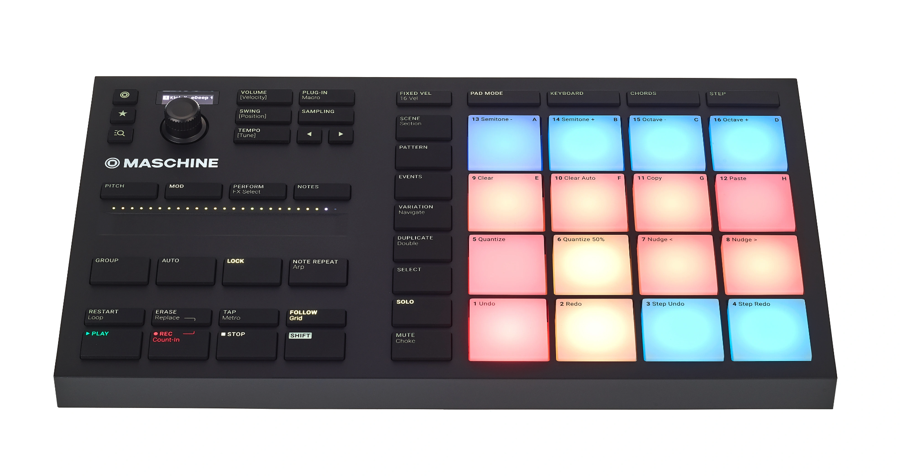

# React-drums

[](https://app.netlify.com/sites/react-drum-machine/deploys)

Love for coding, music and learning new technology in one project, anything goes, I will try anything that seems interesting to this repo.

It is a web version of this



## Requirements

- Docker (it's for the database)

## Overview

- React + Vite SPA
- Apollo GraphQL server
- Prisma ORM
- Postgresql db using Docker

## Demo

> [www.react-drum-machine.netlify.app](https://react-drum-machine.netlify.app/)

## Getting started

Uses [YARN workspaces](https://yarnpkg.com/features/workspaces). Client and Server.

### Client

Install dependencies:

```bash
yarn
```

Development

```bash
yarn dev
```

Production

```bash
yarn build
```

```bash
yarn start
```

## Server

Ensure Docker is on and start the Postgresql container first.

### Database with Docker

cd to the server directory and run these commands:

```bash
docker build -t reactdrums-db .
```

start it:

```bash
docker-compose up -d
```

Prisma generate and migrate

```bash
yarn database:generate
```

```bash
yarn database:migrate
```
